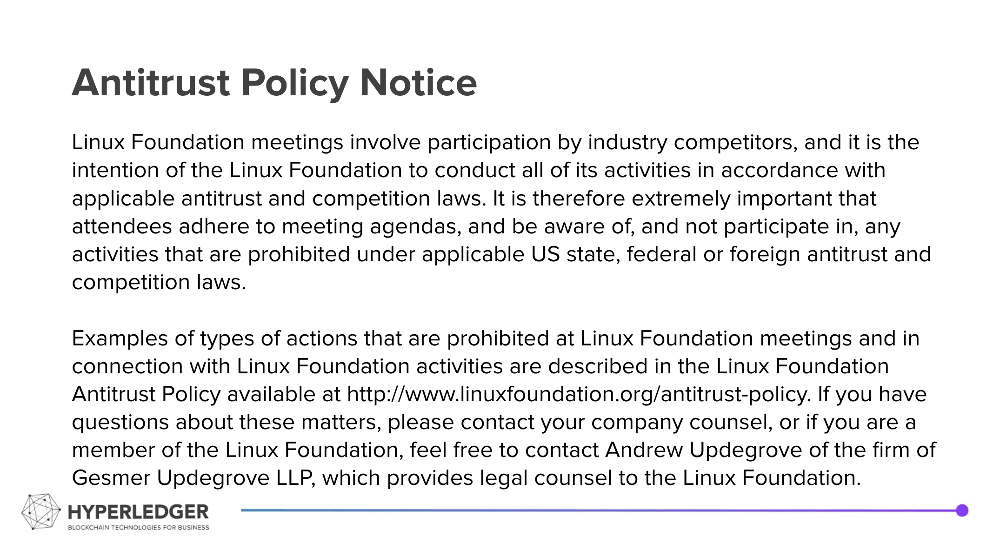

# Technical Working Group in China (TWGC) 

The Technical Working Group China (TWG China, or TWGC) is a bridge between the global Hyperledger community, and the emerging technical user and contributor community in China and the greater China region, including Hong Kong and Taiwan.

Every is welcomed to join TWGC community.   
In open source, we always have a lot to do.   
## Become TWGC developer
> **Developer Oriented**  
> TWGC Github Organization is dedicated for **collaboratvie code development** work contributors  
> While TWGC work scope is not limited to code work, not all TWGC participants have to become TWGC developer  

1. You could contact one of TWGC-coordinators and ask for an invitation. 

    |  Name   | Github ID  | Organization | Email | City | Rocketchat ID |
    | ------ | ---------  | ------  | ---- | ---- | ------------  | 
    | Jay Guo | guoger | RootChain | guojiannan1101@gmail.com | Beijing | guoger |
    | Yang Cheng | stone-ch | CAICT | xzj19922010@gmail.com | Beijing | stone-ch |
    | David Liu | davidkhala | Oracle | david-khala@hotmail.com | Hongkong | davidkhala |

1. You have to enable 2FA for your github account before accepting invitation

1. Once after corordinator sending invitation, You will be receiving an email shortly. You can also visit [Organization HomePage](https://github.com/Hyperledger-TWGC) to accept the invitation.

1. Please make your membership visiblity as **Public**, otherwise your membership is only visible within organization

## CONTRIBUTION

- Remember to enable DCO bot on any new repos.
    - Configure in `Settings -> Branches -> Branch protection rules`
- every commit needs to be signed off to be DCO compliant.
